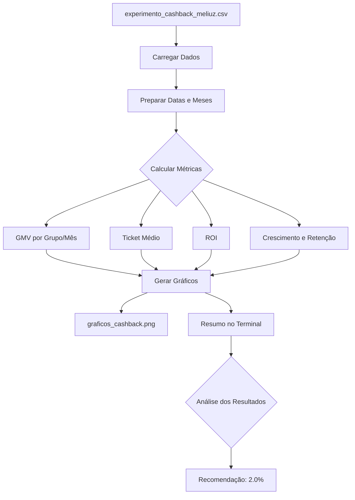

# Case Técnico: Estratégia de Negócios da Méliuz

## Sobre o Caso

Este projeto analisa um experimento A/B/C realizado pela Méliuz para identificar o percentual ideal de cashback que maximiza o crescimento de vendas (GMV) e a retenção de clientes.

## Dados

O arquivo `experimento_cashback_meliuz.csv` contém 2.327 transações de 300 usuários divididos em 3 grupos:

| Grupo | Cashback | Usuários |
|-------|----------|----------|
| A | 1.5% | 100 |
| B | 2.0% | 100 |
| C | 2.5% | 100 |

**Período:** Junho a Agosto de 2024

**Colunas do CSV:**
- `usuario_id` - Identificador do usuário
- `data` - Data da transação
- `valor_compra` - Valor da compra em reais
- `cashback_aplicado` - Percentual de cashback do grupo
- `valor_cashback` - Valor do cashback pago
- `resultado_meliuz` - Lucro da Méliuz na transação

## Fluxo de Análise

## Resultado

O cashback de **2.0%** foi recomendado por apresentar o melhor equilíbrio entre crescimento (+52.6%) e retenção (+20.8%).
