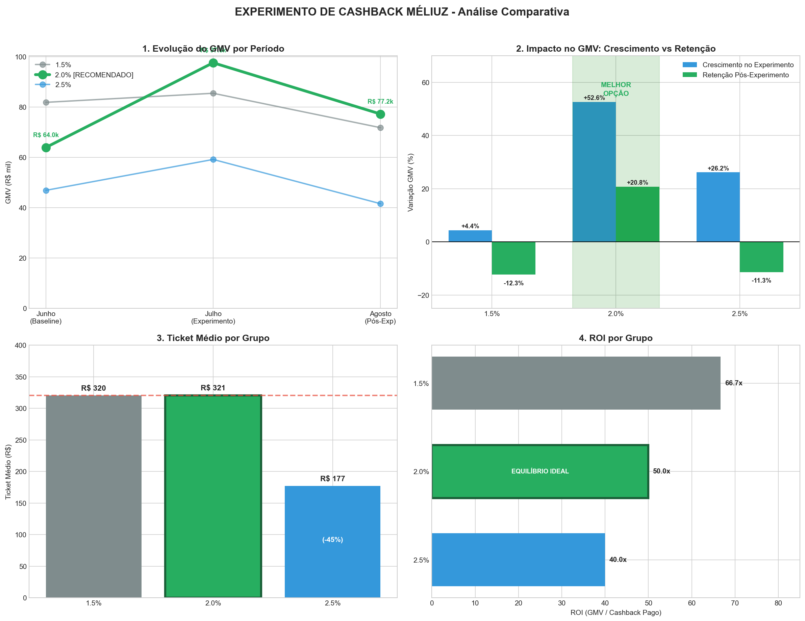

# Relatório Estratégico - Experimento de Cashback Méliuz

## Recomendação: Cashback de 2.0%

---

## Resumo Executivo

A partir da análise dos dados fornecidos, eu recomendo o cashback de **2.0%** pois foi o **único percentual** que demonstrou resultados consistentes em ambas as métricas críticas: **maior crescimento de GMV** durante o experimento **(+52.6%)** e **única retenção positiva** pós-experimento **(+20.8%)**. O cashback de 2.5%, apesar do crescimento inicial (+26.2%), *não sustentou o comportamento* após o fim da campanha (-11.3%), indicando que o incentivo extra *não gera fidelização*. O Grupo A (1.5%) apresentou crescimento mínimo (+4.4%) e sofreu queda de -12.3% no período subsequente. Os dados validam a hipótese de que **existe um ponto ótimo de cashback**, nem tão baixo que não estimule compras, nem tão alto que apenas atraia comportamento oportunista.

Como próximos passos, podemos validar um **rollout gradual dos 2.0%** e treinar modelos para **filtrar perfis oportunistas**. Complementarmente, aplicaremos *LLMs nos comentários pós-compra* e *arquitetura RAG* para investigar qualitativamente a insatisfação, correlacionando os motivos das avaliações negativas com a propensão ao churn dos clientes.

---

## Metodologia do Experimento

| Parâmetro | Valor |
|-----------|-------|
| Período de Análise | Junho a Agosto de 2024 |
| Total de Usuários | 300 (100 por grupo) |
| Total de Transações | 2.327 registros |
| Grupos Testados | 1.5% (Grupo A), 2.0% (Grupo B), 2.5% (Grupo C) |
| Baseline | Junho (antes do experimento) |
| Experimento | Julho (aplicação dos cashbacks) |
| Após Experimento | Agosto (avaliação de retenção) |

---

## Análise de GMV (Volume Financeiro)

| Cashback | GMV Junho | GMV Julho | GMV Agosto | Crescimento Exp | Retenção |
|----------|-----------|-----------|------------|-----------------|--------------|
| 1.5% (Grupo A) | R$ 81.890 | R$ 85.494 | R$ 71.825 | +4.4% | -12.3% |
| **2.0% (Grupo B)** | **R$ 63.965** | **R$ 97.616** | **R$ 77.250** | **+52.6%** | **+20.8%** |
| 2.5% (Grupo C) | R$ 46.923 | R$ 59.203 | R$ 41.617 | +26.2% | -11.3% |

**Insight:** O Grupo B (2.0%) foi o único a sustentar GMV acima do baseline no período após o experimento.

---

## Análise de Ticket Médio

| Cashback | Ticket Junho | Ticket Julho | Ticket Agosto | Média Geral |
|----------|--------------|--------------|---------------|-------------|
| 1.5% (Grupo A) | R$ 312,56 | R$ 323,84 | R$ 325,00 | R$ 320,23 |
| **2.0% (Grupo B)** | **R$ 318,23** | **R$ 329,78** | **R$ 311,49** | **R$ 320,58** |
| 2.5% (Grupo C) | R$ 181,87 | R$ 175,16 | R$ 174,13 | R$ 176,94 |

**Insight:** O Grupo C (2.5%) apresentou ticket médio **45% menor** que os demais grupos, indicando que o cashback mais alto atrai compras de menor valor (comportamento oportunista).

---

## Análise de Custo (Burn Rate) e ROI

| Cashback | Cashback Pago | GMV Gerado | ROI (GMV/Cashback) | Resultado Méliuz |
|----------|---------------|------------|-------------------|------------------|
| 1.5% (Grupo A) | R$ 3.588 | R$ 239.210 | 66.7x | R$ 8.372 |
| **2.0% (Grupo B)** | **R$ 4.777** | **R$ 238.830** | **50.0x** | **R$ 7.165** |
| 2.5% (Grupo C) | R$ 3.694 | R$ 147.742 | 40.0x | R$ 3.694 |

**Insight:** Embora o Grupo B tenha maior custo de cashback, o ROI de 50x é sustentável e gera margem de R$ 7.165 para a Méliuz. O Grupo C tem o pior ROI (40x) e menor margem absoluta.

---

## Análise de Retenção de Usuários

| Cashback | Usuários Jun | Usuários Jul | Usuários Ago | Var. Experimento | Var. Retenção |
|----------|--------------|--------------|--------------|------------------|---------------|
| 1.5% (Grupo A) | 89 | 93 | 86 | +4.5% | -3.4% |
| **2.0% (Grupo B)** | **85** | **91** | **93** | **+7.1%** | **+9.4%** |
| 2.5% (Grupo C) | 89 | 95 | 83 | +6.7% | -6.7% |

**Insight:** Apenas o Grupo B apresentou **crescimento de usuários ativos** no período após o experimento, comprovando criação de hábito e maior LTV.

---

## Conclusão e Recomendação Final

### Grupo A (1.5%) - NÃO RECOMENDADO

| Métrica | Valor | Avaliação |
|---------|-------|-----------|
| Crescimento GMV | +4.4% | Baixo |
| Retenção GMV | -12.3% | Negativa |
| Ticket Médio | R$ 320,23 | Alto |
| ROI | 66.7x | Muito Alto |
| Resultado Méliuz | R$ 8.372 | Alto |

**Por que NÃO é a melhor opção:**
- **Estímulo insuficiente:** O cashback de 1.5% não motiva mudança de comportamento significativa, com crescimento de apenas +4.4% durante o experimento
- **Sem fidelização:** Apesar do ROI alto (66.7x), os usuários não criaram hábito de compra. O GMV caiu -12.3% após o experimento
- **Economia falsa:** Gastar menos em cashback parece eficiente, mas não gera crescimento sustentável
- **Conclusão:** É como não fazer marketing: economiza, mas não conquista clientes

---

### Grupo B (2.0%) - RECOMENDADO ✓

| Métrica | Valor | Avaliação |
|---------|-------|-----------|
| Crescimento GMV | +52.6% | Muito Alto |
| Retenção GMV | +20.8% | Positiva |
| Ticket Médio | R$ 320,58 | Alto |
| ROI | 50.0x | Sustentável |
| Resultado Méliuz | R$ 7.165 | Bom |

**Por que É a melhor opção:**
- **Ponto de equilíbrio ideal:** O cashback de 2.0% é suficiente para estimular compras sem atrair apenas "caçadores de promoção"
- **Maior crescimento:** +52.6% de GMV durante o experimento, ***o dobro do Grupo C e 12x mais que o Grupo A***
- **Única retenção positiva:** +20.8% de GMV e +9.4% de usuários ativos APÓS o fim do experimento, comprovando criação de hábito
- **Qualidade das compras:** Ticket médio alto (R$ 320,58), igual ao Grupo A, mostrando que atrai compras de valor
- **ROI sustentável:** 50x ainda é excelente e gera margem de R$ 7.165 para a empresa
- **Conclusão:** Investe o suficiente para conquistar e reter clientes de qualidade

---

### Grupo C (2.5%) - NÃO RECOMENDADO

| Métrica | Valor | Avaliação |
|---------|-------|-----------|
| Crescimento GMV | +26.2% | Moderado |
| Retenção GMV | -11.3% | Negativa |
| Ticket Médio | R$ 176,94 | Baixo (-45%) |
| ROI | 40.0x | Baixo |
| Resultado Méliuz | R$ 3.694 | Baixo |

**Por que NÃO é a melhor opção:**
- **Atrai comportamento oportunista:** Ticket médio 45% menor indica que o cashback alto atrai compras pequenas de pessoas que só querem o desconto
- **Sem fidelização:** Cresceu +26.2% durante o experimento, mas perdeu -11.3% após. Os usuários somem quando o incentivo acaba
- **Menor lucro:** Resultado Méliuz de apenas R$ 3.694, menos da metade do Grupo B
- **Pior ROI:** 40x, gasta mais e gera menos retorno
- **Efeito "viciado em promoção":** Cria dependência do incentivo alto, insustentável a longo prazo
- **Conclusão:** É como dar desconto demais: atrai cliente errado que não volta

---

### Resumo Comparativo

| Critério | Grupo A (1.5%) | Grupo B (2.0%) | Grupo C (2.5%) |
|----------|----------------|----------------|----------------|
| Estímulo de Compra | Fraco | **Forte** | Moderado |
| Retenção de Clientes | Negativa | **Positiva** | Negativa |
| Qualidade do Cliente | Boa | **Boa** | Ruim |
| Eficiência (ROI) | Alta | **Equilibrada** | Baixa |
| Sustentabilidade | Não | **Sim** | Não |

**Decisão Final:** Implementar cashback de **2.0%** como padrão, pois é o único nível que demonstrou capacidade de **atrair, converter e reter** clientes de qualidade.

---
